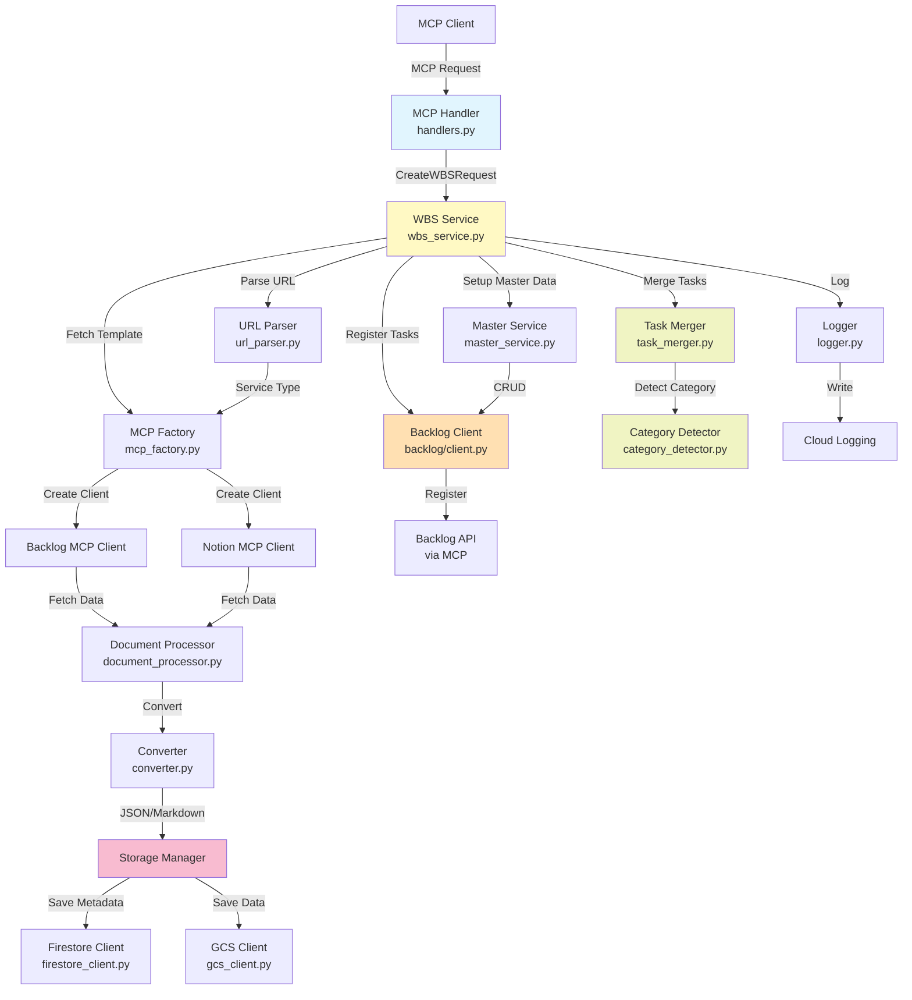

# Design Document

## Overview

WBS作成機能は、MCPサーバーとして動作し、テンプレートURLと新規タスクを受け付けて、Backlogに一括登録する機能です。以下の主要コンポーネントで構成されます：

1. **MCPリクエストハンドラー**: MCPプロトコルでのリクエスト受信とレスポンス返却
2. **WBSサービス**: WBS作成プロセス全体のオーケストレーション
3. **データ取得プロセッサー**: URL解析、外部サービス連携、Document AI変換
4. **タスクマージエンジン**: テンプレートと新規タスクのインテリジェントなマージ
5. **Backlog統合クライアント**: Backlog MCPを通じたタスク登録とマスターデータ管理
6. **ストレージマネージャー**: Firestore/GCSへのメタデータとデータ保存

この設計は、Single Responsibility原則に従い、各コンポーネントを疎結合に保ち、テスト可能性と拡張性を確保します。

## Steering Document Alignment

### Technical Standards (tech.md)

- **言語とランタイム**: Python 3.11+、Google Cloud Functions Gen2
- **MCPアーキテクチャ**: MCP SDKを使用したサーバー実装、Backlog/Notion MCPクライアント統合
- **GCP統合**: Document AI、GCS、Firestore、Cloud Loggingの活用
- **データバリデーション**: Pydanticモデルを使用した型安全なデータ処理
- **依存性注入**: サービスクラスにクライアントを注入し、テスト可能性を確保
- **エラーハンドリング**: try-exceptブロックとリトライ機構（指数バックオフ）
- **ログ戦略**: 構造化ログ（JSON形式）、リクエストIDによるトレーサビリティ

### Project Structure (structure.md)

以下のディレクトリ構造に従って実装します：

```
src/
├── main.py                          # Cloud Functions エントリーポイント
├── mcp/
│   ├── server.py                    # MCPサーバー本体
│   ├── handlers.py                  # create_wbs ハンドラー
│   └── schemas.py                   # CreateWBSRequest/Response スキーマ
├── services/
│   ├── wbs_service.py               # WBS作成オーケストレーション
│   ├── master_service.py            # マスターデータ設定
│   ├── task_merger.py               # タスクマージロジック
│   └── category_detector.py         # カテゴリ自動判定
├── integrations/
│   ├── backlog/
│   │   ├── client.py                # Backlog MCPクライアント
│   │   └── models.py                # Backlogデータモデル
│   ├── notion/
│   │   ├── client.py                # Notion MCPクライアント
│   │   └── models.py                # Notionデータモデル
│   └── mcp_factory.py               # MCPクライアントファクトリ
├── processors/
│   ├── document_processor.py        # Document AI統合
│   ├── converter.py                 # JSON/Markdown変換
│   └── url_parser.py                # URL解析とサービス判定
├── storage/
│   ├── gcs_client.py                # GCSクライアント
│   ├── firestore_client.py          # Firestoreクライアント
│   └── metadata.py                  # メタデータモデル
├── models/
│   ├── task.py                      # Task、TaskCategory モデル
│   ├── metadata.py                  # FileMetadata モデル
│   └── enums.py                     # CategoryEnum、IssueTypeEnum
└── utils/
    ├── logger.py                    # Cloud Loggingラッパー
    ├── config.py                    # 設定管理
    └── validators.py                # URLバリデーション
```

**命名規約**:
- クラス: `PascalCase` (例: `WBSService`, `BacklogClient`)
- 関数/メソッド: `snake_case` (例: `create_wbs()`, `merge_tasks()`)
- 定数: `UPPER_SNAKE_CASE` (例: `DEFAULT_CATEGORY`)
- Pydanticモデル: `PascalCase` (例: `CreateWBSRequest`)

## Code Reuse Analysis

このプロジェクトは新規実装のため、既存コードはありませんが、以下の再利用可能なコンポーネントを設計します：

### Existing Components to Leverage (将来的な再利用)

- **URLParser**: 外部サービス判定ロジックは、将来の課題追加機能でも再利用可能
- **DocumentProcessor**: Document AI統合は、他のファイル処理機能でも共通利用
- **FirestoreClient/GCSClient**: ストレージクライアントは、全機能で共通利用
- **Logger**: 構造化ログラッパーは、全機能で共通利用
- **CategoryDetector**: カテゴリ判定ロジックは、課題追加機能でも利用可能

### Integration Points

- **MCP Server Protocol**: Backlog/Notion MCPサーバーとの統合
- **Google Cloud Services**:
  - Document AI: ファイル解析API
  - Firestore: メタデータストレージ
  - GCS: データファイルストレージ
  - Cloud Logging: ログ記録
- **Backlog API** (MCP経由):
  - タスク取得、登録
  - マスターデータ管理（種別、カテゴリ、カスタム属性）
- **Notion API** (MCP経由):
  - ページ取得
  - データベースクエリ

## Architecture

### アーキテクチャ概要

WBS作成機能は、以下の層で構成されるレイヤードアーキテクチャを採用します：

1. **プロトコル層** (MCP Handler): リクエスト受信とバリデーション
2. **サービス層** (WBS Service): ビジネスロジックのオーケストレーション
3. **プロセッサー層** (Processors): データ変換とドメインロジック
4. **統合層** (Integrations): 外部サービスとの通信
5. **ストレージ層** (Storage): データ永続化

### Modular Design Principles

- **Single File Responsibility**: 各ファイルは単一の責務を持つ
  - `wbs_service.py`: WBS作成プロセスのオーケストレーションのみ
  - `task_merger.py`: タスクマージロジックのみ
  - `category_detector.py`: カテゴリ判定ロジックのみ
- **Component Isolation**: 小さく焦点を絞ったコンポーネント
  - 各サービスクラスは500行以内
  - 各メソッドは50行以内
- **Service Layer Separation**: 層の責務分離
  - MCPハンドラー: リクエスト/レスポンス変換のみ
  - サービス層: ビジネスロジックのみ
  - ストレージ層: データアクセスのみ
- **Utility Modularity**: 単一目的のユーティリティ
  - `url_parser.py`: URL解析とサービス判定のみ
  - `validators.py`: バリデーションロジックのみ

### アーキテクチャ図



### 処理フロー

1. **リクエスト受信**: MCP Handlerが`create_wbs`リクエストを受信
2. **マスターデータ設定**: Master Serviceが種別、カテゴリ、カスタム属性を設定
3. **テンプレート取得**:
   - URL Parserがサービスタイプを判定
   - MCP Factoryが適切なクライアント（Backlog/Notion）を生成
   - MCPクライアントが階層データを取得
   - Document Processorがファイルを解析（必要に応じてDocument AI使用）
   - ConverterがJSON/Markdownに変換
   - Storage Managerがメタデータ（Firestore）とデータ（GCS）を保存
4. **新規タスク解析**:
   - Converterが新規タスクテキストをパース
   - Category Detectorがカテゴリを自動判定
5. **タスクマージ**:
   - Task Mergerがテンプレートタスクと新規タスクをマージ
   - カテゴリ順にソート
6. **Backlog登録**:
   - Backlog Clientが既存タスクを取得
   - 重複チェック実施
   - 未登録タスクのみを一括登録
7. **結果返却**: MCP Handlerが登録結果をレスポンスとして返却

## Components and Interfaces

### Component 1: MCP Handler (handlers.py)

- **Purpose**: MCPリクエストを受信し、WBSServiceに委譲し、レスポンスを返却
- **Interfaces**:
  ```python
  async def handle_create_wbs(request: CreateWBSRequest) -> CreateWBSResponse:
      """WBS作成リクエストをハンドリング"""
  ```
- **Dependencies**: `WBSService`, `CreateWBSRequest`, `CreateWBSResponse`
- **Reuses**: なし（新規実装）

### Component 2: WBS Service (wbs_service.py)

- **Purpose**: WBS作成プロセス全体のオーケストレーション
- **Interfaces**:
  ```python
  class WBSService:
      def __init__(
          self,
          master_service: MasterService,
          url_parser: URLParser,
          mcp_factory: MCPFactory,
          task_merger: TaskMerger,
          backlog_client: BacklogClient,
          storage_manager: StorageManager,
          logger: Logger
      ):
          """依存性注入によるクライアント設定"""

      async def create_wbs(
          self,
          template_url: str,
          new_tasks_text: str,
          project_key: str
      ) -> WBSResult:
          """WBSを作成してBacklogに登録"""
  ```
- **Dependencies**: `MasterService`, `URLParser`, `MCPFactory`, `TaskMerger`, `BacklogClient`, `StorageManager`, `Logger`
- **Reuses**: 各種サービスとクライアントを統合

### Component 3: Master Service (master_service.py)

- **Purpose**: Backlogプロジェクトのマスターデータを設定
- **Interfaces**:
  ```python
  class MasterService:
      def __init__(self, backlog_client: BacklogClient, logger: Logger):
          """依存性注入"""

      async def setup_master_data(self, project_key: str) -> MasterDataResult:
          """種別、カテゴリ、カスタム属性を設定"""

      async def _ensure_issue_types(self, project_key: str) -> List[str]:
          """種別（課題、リスク）を確認・追加"""

      async def _ensure_categories(self, project_key: str) -> List[str]:
          """カテゴリを確認・追加"""

      async def _ensure_custom_fields(self, project_key: str) -> List[str]:
          """カスタム属性（インプット、ゴール/アウトプット）を確認・追加"""
  ```
- **Dependencies**: `BacklogClient`, `Logger`
- **Reuses**: `BacklogClient`を使用してマスターデータCRUD

### Component 4: URL Parser (url_parser.py)

- **Purpose**: URLを解析して外部サービスタイプを判定
- **Interfaces**:
  ```python
  class URLParser:
      def parse_service_type(self, url: str) -> ServiceType:
          """URLからサービスタイプ（Backlog/Notion）を判定"""

      def validate_url(self, url: str) -> bool:
          """URL形式をバリデーション"""
  ```
- **Dependencies**: なし（純粋関数）
- **Reuses**: なし（新規実装）

### Component 5: MCP Factory (mcp_factory.py)

- **Purpose**: サービスタイプに応じたMCPクライアントを生成
- **Interfaces**:
  ```python
  class MCPFactory:
      def create_client(self, service_type: ServiceType) -> Union[BacklogMCPClient, NotionMCPClient]:
          """サービスタイプに応じたMCPクライアントを生成"""
  ```
- **Dependencies**: `BacklogMCPClient`, `NotionMCPClient`
- **Reuses**: なし（ファクトリパターン実装）

### Component 6: Backlog MCP Client (integrations/backlog/client.py)

- **Purpose**: Backlog MCPサーバーとの通信
- **Interfaces**:
  ```python
  class BacklogMCPClient:
      async def fetch_data(self, url: str) -> Dict[str, Any]:
          """BacklogからURLのデータを取得"""

      async def get_tasks(self, project_key: str) -> List[BacklogTask]:
          """プロジェクトのタスク一覧を取得"""

      async def create_tasks(self, project_key: str, tasks: List[Task]) -> List[BacklogTask]:
          """タスクを一括登録"""

      async def get_issue_types(self, project_key: str) -> List[IssueType]:
          """種別一覧を取得"""

      async def create_issue_type(self, project_key: str, name: str) -> IssueType:
          """種別を作成"""

      async def get_categories(self, project_key: str) -> List[Category]:
          """カテゴリ一覧を取得"""

      async def create_category(self, project_key: str, name: str) -> Category:
          """カテゴリを作成"""

      async def get_custom_fields(self, project_key: str) -> List[CustomField]:
          """カスタム属性一覧を取得"""

      async def create_custom_field(self, project_key: str, field: CustomFieldInput) -> CustomField:
          """カスタム属性を作成"""
  ```
- **Dependencies**: MCP SDK、Backlog MCP接続情報
- **Reuses**: MCP SDKのクライアント機能

### Component 7: Notion MCP Client (integrations/notion/client.py)

- **Purpose**: Notion MCPサーバーとの通信
- **Interfaces**:
  ```python
  class NotionMCPClient:
      async def fetch_data(self, url: str) -> Dict[str, Any]:
          """NotionからURLのデータを取得"""
  ```
- **Dependencies**: MCP SDK、Notion MCP接続情報
- **Reuses**: MCP SDKのクライアント機能

### Component 8: Document Processor (processors/document_processor.py)

- **Purpose**: Document AIを使用してファイルを解析
- **Interfaces**:
  ```python
  class DocumentProcessor:
      def __init__(self, documentai_client, logger: Logger):
          """Document AIクライアントを注入"""

      async def process_file(self, file_content: bytes, mime_type: str) -> str:
          """ファイルをテキストに変換（Document AI使用）"""
  ```
- **Dependencies**: `google-cloud-documentai`, `Logger`
- **Reuses**: Google Cloud Document AI API

### Component 9: Converter (processors/converter.py)

- **Purpose**: データをJSON/Markdownに変換
- **Interfaces**:
  ```python
  class Converter:
      def convert_to_json(self, data: Any) -> Dict[str, Any]:
          """データをJSON形式に変換"""

      def convert_to_markdown(self, text: str) -> str:
          """テキストをMarkdown形式に変換"""

      def parse_tasks_from_text(self, text: str) -> List[Task]:
          """テキストからタスクリストをパース"""
  ```
- **Dependencies**: なし（純粋関数）
- **Reuses**: なし（新規実装）

### Component 10: Task Merger (services/task_merger.py)

- **Purpose**: テンプレートタスクと新規タスクをマージ
- **Interfaces**:
  ```python
  class TaskMerger:
      def __init__(self, category_detector: CategoryDetector, logger: Logger):
          """依存性注入"""

      def merge_tasks(self, template_tasks: List[Task], new_tasks: List[Task]) -> List[Task]:
          """タスクリストをマージしてカテゴリ順にソート"""
  ```
- **Dependencies**: `CategoryDetector`, `Logger`
- **Reuses**: `CategoryDetector`

### Component 11: Category Detector (services/category_detector.py)

- **Purpose**: タスク内容からカテゴリを自動判定
- **Interfaces**:
  ```python
  class CategoryDetector:
      def detect_category(self, task: Task) -> CategoryEnum:
          """タスクのタイトルと説明からカテゴリを判定"""

      def _match_keywords(self, text: str, category: CategoryEnum) -> float:
          """テキストとカテゴリのキーワードマッチングスコア"""
  ```
- **Dependencies**: なし（ルールベース実装）
- **Reuses**: なし（新規実装）

### Component 12: Storage Manager (storage/)

- **Purpose**: Firestore/GCSへのデータ保存
- **Interfaces**:
  ```python
  class StorageManager:
      def __init__(
          self,
          firestore_client: FirestoreClient,
          gcs_client: GCSClient,
          logger: Logger
      ):
          """依存性注入"""

      async def save_data(
          self,
          parent_url: str,
          file_url: str,
          file_name: str,
          data: Union[Dict, str],
          format: str
      ) -> FileMetadata:
          """データとメタデータを保存（バージョン管理）"""

      async def get_latest_version(self, file_url: str) -> Optional[FileMetadata]:
          """最新バージョンのメタデータを取得"""

      async def get_data(self, metadata: FileMetadata) -> Union[Dict, str]:
          """メタデータを元にGCSからデータを取得"""
  ```
- **Dependencies**: `FirestoreClient`, `GCSClient`, `Logger`
- **Reuses**: `FirestoreClient`, `GCSClient`

### Component 13: Firestore Client (storage/firestore_client.py)

- **Purpose**: Firestoreへのメタデータ保存・検索
- **Interfaces**:
  ```python
  class FirestoreClient:
      async def save_metadata(self, metadata: FileMetadata) -> str:
          """メタデータをFirestoreに保存"""

      async def get_latest_metadata(self, file_url: str) -> Optional[FileMetadata]:
          """最新バージョンのメタデータを取得"""

      async def get_metadata_by_version(self, file_url: str, version: int) -> Optional[FileMetadata]:
          """特定バージョンのメタデータを取得"""
  ```
- **Dependencies**: `google-cloud-firestore`
- **Reuses**: Google Cloud Firestore API

### Component 14: GCS Client (storage/gcs_client.py)

- **Purpose**: GCSへのデータ保存・取得
- **Interfaces**:
  ```python
  class GCSClient:
      async def upload_data(self, bucket: str, path: str, data: Union[Dict, str]) -> str:
          """データをGCSにアップロード"""

      async def download_data(self, bucket: str, path: str) -> Union[Dict, str]:
          """GCSからデータをダウンロード"""
  ```
- **Dependencies**: `google-cloud-storage`
- **Reuses**: Google Cloud Storage API

### Component 15: Logger (utils/logger.py)

- **Purpose**: 構造化ログをCloud Loggingに記録
- **Interfaces**:
  ```python
  class Logger:
      def __init__(self, request_id: str):
          """リクエストIDを設定してトレーサビリティ確保"""

      def info(self, message: str, **kwargs):
          """INFOレベルログ"""

      def error(self, message: str, error: Exception = None, **kwargs):
          """ERRORレベルログ"""

      def debug(self, message: str, **kwargs):
          """DEBUGレベルログ"""
  ```
- **Dependencies**: `google-cloud-logging`
- **Reuses**: Google Cloud Logging API

## Data Models

### CreateWBSRequest (mcp/schemas.py)

```python
from pydantic import BaseModel, HttpUrl

class CreateWBSRequest(BaseModel):
    """WBS作成リクエスト"""
    template_url: HttpUrl  # テンプレートURL（Backlog or Notion）
    new_tasks_text: str  # 新規タスクのテキスト（Markdown形式）
    project_key: str  # Backlogプロジェクトキー
```

### CreateWBSResponse (mcp/schemas.py)

```python
from typing import List
from pydantic import BaseModel

class TaskResult(BaseModel):
    """登録されたタスクの結果"""
    id: str  # Backlogタスクキー
    title: str  # タスクタイトル
    url: str  # BacklogタスクURL
    category: str  # カテゴリ

class CreateWBSResponse(BaseModel):
    """WBS作成レスポンス"""
    success: bool  # 成功/失敗
    registered_tasks: List[TaskResult]  # 登録成功タスク
    skipped_tasks: List[str]  # スキップされたタスクのタイトル
    error_message: Optional[str] = None  # エラーメッセージ
    metadata_id: Optional[str] = None  # FirestoreメタデータドキュメントID
```

### Task (models/task.py)

```python
from pydantic import BaseModel
from typing import Optional
from .enums import CategoryEnum

class Task(BaseModel):
    """タスクモデル"""
    title: str  # タスクタイトル
    description: Optional[str] = None  # タスク説明
    category: CategoryEnum  # カテゴリ
    priority: Optional[str] = None  # 優先度（高、中、低）
    assignee: Optional[str] = None  # 担当者
    input: Optional[str] = None  # インプット（カスタム属性）
    goal_output: Optional[str] = None  # ゴール/アウトプット（カスタム属性）
```

### FileMetadata (models/metadata.py)

```python
from pydantic import BaseModel, HttpUrl
from datetime import datetime

class FileMetadata(BaseModel):
    """ファイルメタデータ"""
    id: Optional[str] = None  # FirestoreドキュメントID
    source_file_name: str  # 取得元ファイル名
    parent_url: HttpUrl  # 親URL
    file_url: HttpUrl  # ファイルURL
    file_name: str  # ファイル名
    updated_at: datetime  # 更新日
    version: int  # バージョン番号
    format: str  # フォーマット（json or markdown）
    gcs_path: str  # GCS保存パス
```

### CategoryEnum (models/enums.py)

```python
from enum import Enum

class CategoryEnum(str, Enum):
    """カテゴリ列挙型"""
    PREPARATION = "事前準備"
    REQUIREMENTS = "要件定義"
    BASIC_DESIGN = "基本設計"
    IMPLEMENTATION = "実装"
    TESTING = "テスト"
    RELEASE = "リリース"
    DELIVERY = "納品"
```

### IssueTypeEnum (models/enums.py)

```python
class IssueTypeEnum(str, Enum):
    """種別列挙型"""
    TASK = "課題"
    RISK = "リスク"
```

### ServiceType (processors/url_parser.py)

```python
class ServiceType(str, Enum):
    """外部サービスタイプ"""
    BACKLOG = "backlog"
    NOTION = "notion"
```

## Error Handling

### Error Scenarios

1. **無効なURL**
   - **Handling**: URLParserでバリデーション失敗時に`ValueError`をスロー。WBSServiceでキャッチしてエラーレスポンス返却
   - **User Impact**: `CreateWBSResponse`の`error_message`に「URLが無効です。BacklogまたはNotionのURLを指定してください」を設定

2. **外部サービス接続エラー**
   - **Handling**: MCP Clientでの通信失敗時に`ConnectionError`をスロー。3回までリトライ（指数バックオフ：1秒、2秒、4秒）
   - **User Impact**: リトライ後も失敗した場合、「Backlog/Notionとの接続に失敗しました。しばらく待ってから再試行してください」

3. **Document AI処理エラー**
   - **Handling**: Document Processorでの解析失敗時に`ProcessingError`をスロー。エラーログを記録し、処理を中断
   - **User Impact**: 「ファイルの解析に失敗しました。ファイル形式を確認してください」

4. **Backlog API認証エラー**
   - **Handling**: Backlog Clientでの401エラー時に`AuthenticationError`をスロー
   - **User Impact**: 「Backlog APIの認証に失敗しました。APIキーを確認してください」

5. **タスク重複エラー**
   - **Handling**: 重複タスクは`skipped_tasks`リストに追加し、登録をスキップ（エラーではない）
   - **User Impact**: `CreateWBSResponse`の`skipped_tasks`に重複タスクのタイトルをリスト表示

6. **Firestore/GCS保存エラー**
   - **Handling**: Storage Managerでの保存失敗時に`StorageError`をスロー。エラーログを記録し、処理を中断
   - **User Impact**: 「データの保存に失敗しました。GCPの権限設定を確認してください」

7. **カテゴリ判定失敗**
   - **Handling**: Category Detectorで判定不能時は`DEFAULT_CATEGORY`（要件定義）を使用。警告ログを記録
   - **User Impact**: ユーザーには影響なし（デフォルトカテゴリが使用される）

8. **タイムアウトエラー**
   - **Handling**: 各API呼び出しにタイムアウト設定（Backlog: 30秒、Document AI: 60秒、GCS/Firestore: 10秒）
   - **User Impact**: 「処理がタイムアウトしました。データサイズが大きすぎる可能性があります」

### エラーレスポンス例

```python
# 成功時
CreateWBSResponse(
    success=True,
    registered_tasks=[
        TaskResult(id="PROJ-123", title="要件定義", url="...", category="要件定義"),
        TaskResult(id="PROJ-124", title="基本設計", url="...", category="基本設計")
    ],
    skipped_tasks=["既存タスク1"],  # 重複スキップ
    error_message=None,
    metadata_id="abc123def456"
)

# エラー時
CreateWBSResponse(
    success=False,
    registered_tasks=[],
    skipped_tasks=[],
    error_message="Backlog APIの認証に失敗しました。APIキーを確認してください",
    metadata_id=None
)
```

## Testing Strategy

### Unit Testing

**テストフレームワーク**: pytest

**テスト対象**:
- `URLParser.parse_service_type()`: URL解析ロジック
- `CategoryDetector.detect_category()`: カテゴリ判定ロジック
- `TaskMerger.merge_tasks()`: タスクマージロジック
- `Converter.parse_tasks_from_text()`: テキストパースロジック
- 各Pydanticモデルのバリデーション

**テストケース例**:
```python
# tests/unit/test_processors/test_url_parser.py
def test_parse_backlog_url():
    parser = URLParser()
    service_type = parser.parse_service_type("https://example.backlog.com/...")
    assert service_type == ServiceType.BACKLOG

def test_parse_notion_url():
    parser = URLParser()
    service_type = parser.parse_service_type("https://www.notion.so/...")
    assert service_type == ServiceType.NOTION

def test_invalid_url():
    parser = URLParser()
    with pytest.raises(ValueError):
        parser.parse_service_type("https://example.com/...")
```

```python
# tests/unit/test_services/test_category_detector.py
def test_detect_requirements_category():
    detector = CategoryDetector()
    task = Task(title="要件のヒアリング", description="顧客要件を確認する")
    category = detector.detect_category(task)
    assert category == CategoryEnum.REQUIREMENTS

def test_detect_implementation_category():
    detector = CategoryDetector()
    task = Task(title="APIの実装", description="REST APIを開発する")
    category = detector.detect_category(task)
    assert category == CategoryEnum.IMPLEMENTATION
```

### Integration Testing

**テスト対象**:
- Backlog MCP Client統合テスト（モックMCPサーバー使用）
- Firestore/GCS統合テスト（エミュレータ使用）
- WBSService統合テスト（モック外部サービス使用）

**テストケース例**:
```python
# tests/integration/test_backlog_integration.py
@pytest.mark.asyncio
async def test_create_tasks_integration():
    # Backlog MCPモックサーバーを起動
    mock_server = MockBacklogMCPServer()
    client = BacklogMCPClient(mock_server.url)

    tasks = [
        Task(title="タスク1", category=CategoryEnum.REQUIREMENTS),
        Task(title="タスク2", category=CategoryEnum.IMPLEMENTATION)
    ]

    result = await client.create_tasks("PROJ", tasks)
    assert len(result) == 2
    assert result[0].title == "タスク1"
```

```python
# tests/integration/test_gcp_integration.py
@pytest.mark.asyncio
async def test_storage_manager_save_and_retrieve():
    # Firestore/GCSエミュレータを使用
    firestore_client = FirestoreClient(emulator=True)
    gcs_client = GCSClient(emulator=True)
    storage_manager = StorageManager(firestore_client, gcs_client, logger)

    # データ保存
    metadata = await storage_manager.save_data(
        parent_url="https://example.backlog.com/...",
        file_url="https://example.backlog.com/.../file",
        file_name="template.xlsx",
        data={"tasks": [...]},
        format="json"
    )

    # データ取得
    retrieved_data = await storage_manager.get_data(metadata)
    assert retrieved_data == {"tasks": [...]}
```

### End-to-End Testing

**テスト対象**:
- WBS作成エンドツーエンドフロー（MCPリクエスト→Backlog登録→レスポンス）

**テストシナリオ**:
1. **正常系**: テンプレートURL + 新規タスク → Backlog登録成功
2. **重複スキップ**: 既存タスクと重複するタスクをスキップ
3. **エラーハンドリング**: 無効なURL → エラーレスポンス返却
4. **マスターデータ設定**: 不足しているカテゴリを自動追加

**テストケース例**:
```python
# tests/e2e/test_wbs_creation_flow.py
@pytest.mark.asyncio
async def test_wbs_creation_end_to_end():
    # テスト用Backlogプロジェクトとモックサーバーを準備
    mock_backlog = MockBacklogServer()
    mock_backlog.add_project("TEST")

    # MCPリクエスト作成
    request = CreateWBSRequest(
        template_url="https://example.backlog.com/template",
        new_tasks_text="- タスク1: 要件確認\n- タスク2: 設計レビュー",
        project_key="TEST"
    )

    # WBS作成実行
    response = await handle_create_wbs(request)

    # 検証
    assert response.success == True
    assert len(response.registered_tasks) == 2
    assert response.registered_tasks[0].title == "タスク1"
    assert response.registered_tasks[0].category == "要件定義"
```

### テストカバレッジ目標
- **全体**: 80%以上
- **ビジネスロジック** (services/): 90%以上
- **データ処理** (processors/): 85%以上
- **統合層** (integrations/): 70%以上（モック使用）
- **ストレージ層** (storage/): 75%以上（エミュレータ使用）
